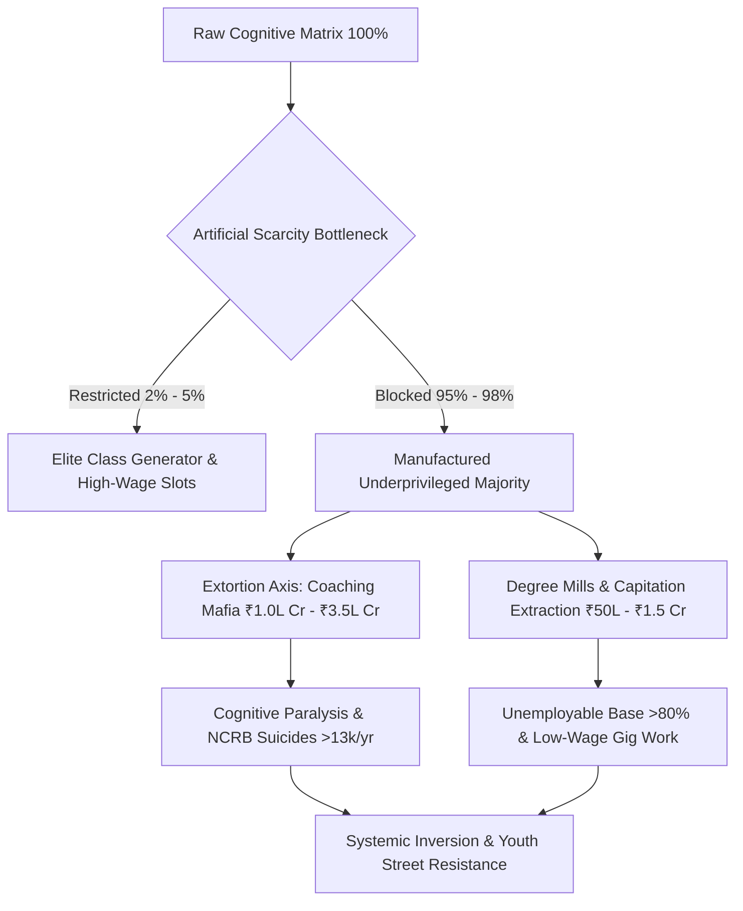
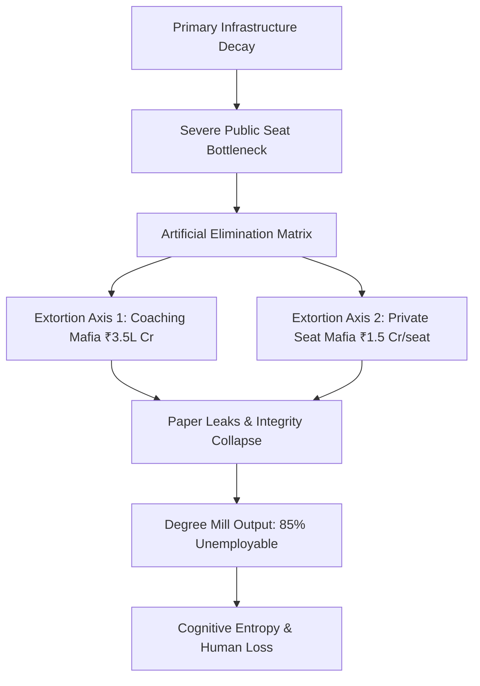
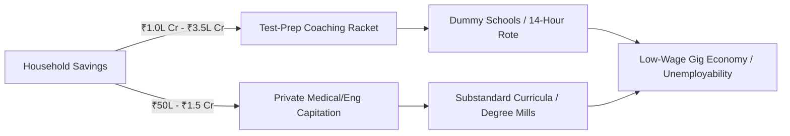
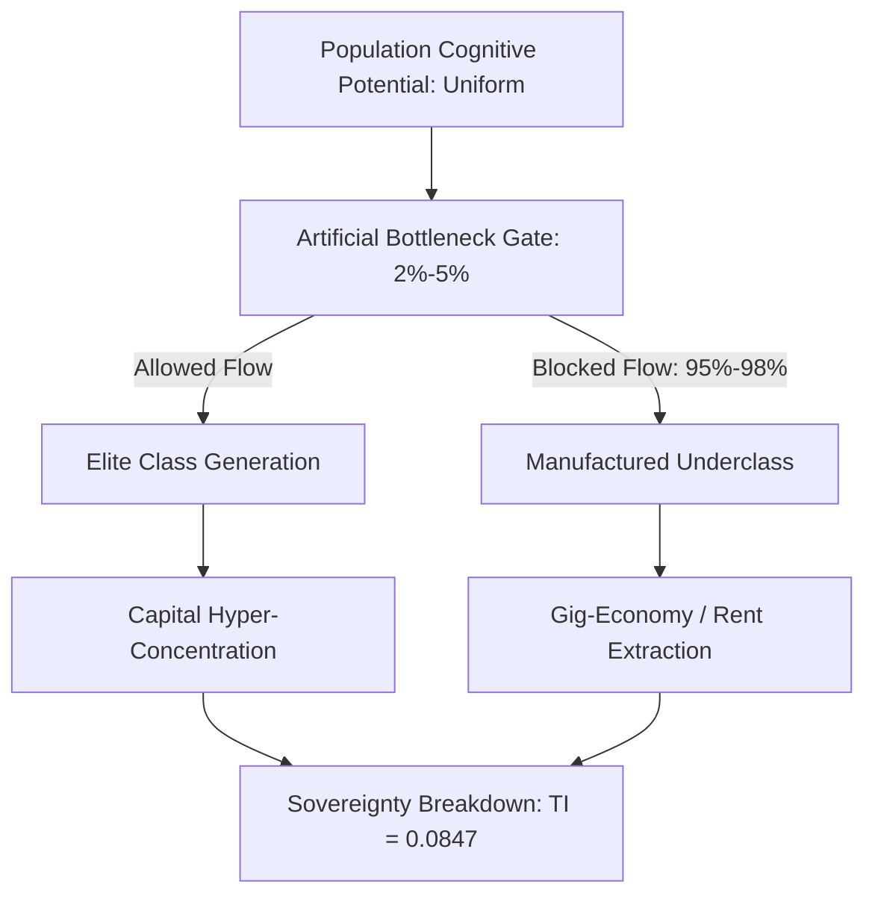
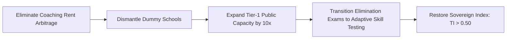
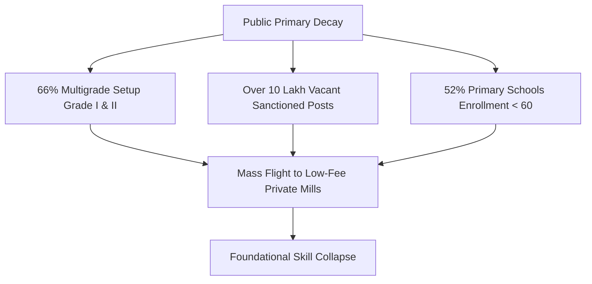
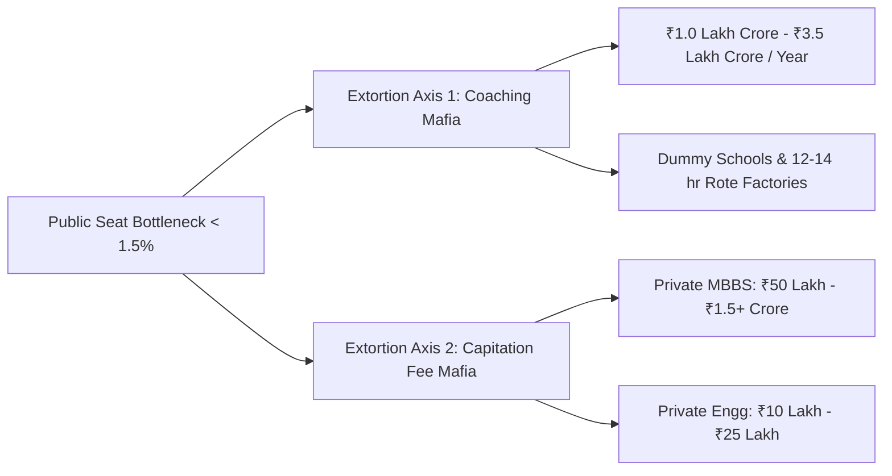

<script type="text/javascript" async src="https://cdnjs.cloudflare.com/ajax/libs/mathjax/2.7.7/MathJax.js?config=TeX-MML-AM_CHTML"> </script>

# SYSTEM PROFILE: SYSTEMIC RUIN OF EDUCATION & COMMODITY EXTRACTION

## 1. VECTOR TELEMETRY & SYSTEM METRICS
* $\text{Vector Identity: Systemic Ruin of Education and Commodity Extraction}$
* $\text{Thermodynamic Transmission Rate: } \frac{dS_{\text{Civilization}}}{dt} \propto \frac{1}{\eta_{\text{Edu}}}$
* $\text{Political Independence (PI): } \text{PI} = 0.90$
* $\text{Economic Independence (EI): } \text{EI} = 0.08$
* $\text{Social Independence (SI): } \text{SI} = 0.70$
* $\text{Total Sovereignty Index (TI): } \text{TI} = (\text{PI} + \text{EI} + \text{SI}) \times (\text{PI} \times \text{EI} \times \text{SI}) = 0.084672$

## 2. LOCAL EMPIRICAL DECAY & ELIMINATION MATRIX
* $\text{Foundational Learning Deficit: Over 50\% of Grade 5 students in rural public schools cannot read Grade 2 text.}$
* $\text{Multigrade Classroom Contraction: 66\% of Grade I and II public primary classrooms run on multigrade setups; >10 Lakh vacancies.}$
* $\text{UPSC CSE Elimination: 13.0 Lakh Applicants } \rightarrow \text{ 1,000 Seats } \Rightarrow \text{ Rejection Rate: 99.92\%}$
* $\text{IIT-JEE Adv Elimination: 14.5 Lakh Applicants } \rightarrow \text{ 17,500 Seats } \Rightarrow \text{ Rejection Rate: 98.80\%}$
* $\text{NEET-UG Elimination: 24.0 Lakh Applicants } \rightarrow \text{ 55,000 Govt Seats } \Rightarrow \text{ Rejection Rate: 97.71\%}$
* $\text{CAT Management Elimination: 3.3 Lakh Applicants } \rightarrow \text{ 5,500 Seats } \Rightarrow \text{ Rejection Rate: 98.34\%}$
* $\text{Test-Prep Extortion Axis: Coaching mafia extracts ₹1.0 Lakh Crore to ₹3.5 Lakh Crore annually from households.}$
* $\text{Private Capitation Fee Axis: Private MBBS seats cost ₹50 Lakh to ₹1.5+ Crore; Engineering costs ₹10 Lakh to ₹25 Lakh.}$
* $\text{NCRB Mortality Telemetry: >13,000 student suicides annually (>35 deaths/day); 12,598 exam failure deaths in 5 years.}$
* $\text{Paper Leak Scam Network: Over 70+ major exam leaks across 15+ states affecting >1.5 Crore to 2.0 Crore aspirants.}$
* $\text{Employability Paradox: Only 3.84\% engineering graduates possess software skills; >80\% to 85\% remain unemployable.}$

## 3. UNIVERSAL PHYSICS & THERMODYNAMIC FORMULATION
* $\text{Anti-Entropic Axiom: Education is the primary anti-entropic information transmission mechanism of civilization.}$
* $\text{Thermodynamic Decay Law: } \frac{dS_{\text{Civilization}}}{dt} \propto \frac{1}{\eta_{\text{Edu}}} \quad (\text{As } \eta_{\text{Edu}} \rightarrow 0, S \rightarrow \infty)$
* $\text{Cognitive Uniformity Invariant: Intelligence and potential are uniformly distributed across the population matrix.}$
* $\text{Class Generator Mechanism: Restricting quality skill access to a 2\%--5\% numerical threshold generates the elite class.}$
* $\text{Manufactured Underprivilege: Bottlenecking the skill floor manufactures a low-wage 95\%--98\% majority } (L_{\text{Gini}} \approx 0.92).$
* $\text{Commodity Inversion: Signal Transmission (capability) flips to Noise Generation (rote gaming and artificial scarcity).}$

## 4. SYSTEM FLOW & EXTRACTION DIAGRAM


## 5. SOVEREIGNTY TRIAD CALCULUS & PHASE TRANSITION
* $\text{Political Independence Collapse: Mass psychological manipulation and demagoguery of unequipped nodes.}$
* $\text{Economic Independence Collapse: Incurring credential debt without functional skills } (\text{EI} \rightarrow 0.08).$
* $\text{Social Independence Collapse: Hyper-elimination, public humiliation, and psychological despair } (\text{SI} = 0.70).$
* $\text{Triad Coupling Equation: } \text{TI} = (0.90 + 0.08 + 0.70) \times (0.90 \times 0.08 \times 0.70) = 0.084672 \ll 1.0$
* $\text{Phase Transition Boundary: System reaches critical threshold between total technological collapse and active youth street inversion.}$

# INSTITUTIONAL INVESTOR MEMORANDUM & SYSTEMIC LEDGER

**TO:** Global Sovereign Wealth Funds, Institutional Allocation Committees, and Macro-Policy Strategists  
**FROM:** Systemic Risk & Human Capital Analytics Division  
**SUBJECT:** Systemic Ruin of Education and Commodity Extraction (Vertical 1: Education Matrix)  
**DATE:** March 2025  
**STATUS:** Strict Institutional Audit / Production-Grade Telemetry  

---

## 1. EXECUTIVE SUMMARY & INVESTMENT THESIS

The human capital infrastructure of the target geography exhibits terminal efficiency loss, structural rent-seeking, and artificial scarcity engineering. Education, originally the primary anti-entropic information transmission mechanism of a sovereign state, has been inverted into an extractive commodity lottery. 

### Key Systemic Risk Metrics
* $\text{Total Sector Rent Extraction (Coaching Axis)} = \text{₹1.0 Lakh Crore to ₹3.5 Lakh Crore (12B–42B USD/year)}$
* $\text{Macro Efficiency Index } (\eta_{\text{Edu}}) = 0.0384 \quad (3.84\% \text{ industry-grade skill baseline})$
* $\text{Systemic Rejection Rate (Elite Gates)} = 97.71\% - 99.92\%$
* $\text{Human Capital Wastage Rate} = 80.0\% - 85.0\% \quad (\text{unemployable degree holders})$
* $\text{Civilizational Sovereignty Index } (\text{TI}) = 0.084672 \quad (\text{Structural Insolvency Zone})$



---

## 2. MARKET FAILURE & FOUNDATIONAL DECAY (EMPIRICAL MATRIX)

### 2.1 Primary & Secondary Infrastructure Insolvency
* $\text{ASER Foundational Literacy Deficit}: >50\% \text{ of Grade 5 rural public students cannot read Grade 2 text or perform 3-digit division.}$
* $\text{Multigrade Classroom Ratio}: 66\% \text{ of Grade I and II public primary classrooms operate in multigrade setups.}$
* $\text{Enrolment Flight Pattern}: >52\% \text{ of primary public schools maintain } <60 \text{ students due to mass flight to low-fee private setups.}$
* $\text{Public Sanctioned Vacancy Gap}: >10 \text{ Lakh } (1.0 \text{ Million}+) \text{ sanctioned teaching posts remain unfilled nationwide.}$

### 2.2 Public Higher Education Gatekeeping & Hyper-Inflation
* $\text{Central University Cut-offs (CUET-UG)}: 98.5\% \text{ to } 99.8\% \text{ percentile } (780\text{--}795+/800) \text{ across top-tier public colleges.}$
* $\text{Premier Seat Bottleneck}: \text{Tier-1 public higher education seats constitute } <1.5\% \text{ of the } >40 \text{ Million applicant pool.}$

---

## 3. THE EXTREME ELIMINATION MATRIX (SELECTION vs. ELIMINATION)

The operational model of national testing agencies is designed around raw statistical elimination rather than capability verification.

| Competitive Gate | Applicant Pool | Seat Yield | Rejection Rate ($\%$) | Structural Target |
| :--- | :--- | :--- | :--- | :--- |
| **UPSC Civil Services (CSE)** | $\sim 13.0 \text{ Lakh}$ | $\sim 1,000$ | 99.92% | Hyper-Elimination |
| **IIT-JEE Advanced** | $\sim 14.5 \text{ Lakh}$ | $\sim 17,500$ | 98.80% | Capital Filtering |
| **NEET-UG (Govt MBBS)** | $\sim 24.0 \text{ Lakh}$ | $\sim 55,000$ | 97.71% | Scarcity Arbitrage |
| **CAT (IIM Management)** | $\sim 3.3 \text{ Lakh}$ | $\sim 5,500$ | 98.34% | Executive Bottleneck |

* $\text{Overall Public Medical Rejection Rate}: 98.15\% \text{ across all government medical quotas.}$
* $\text{Artificial Scarcity Factor}: \text{The surface seat-to-candidate ratio is intentionally constricted to sustain private yield.}$

---

## 4. UNIT ECONOMICS OF EXTORTION & ARBITRAGE



### 4.1 Extortion Mechanics (Axis 1 & Axis 2)
* $\text{Axis 1: Test-Prep and Coaching Monopoly}: \text{Extracts } \text{₹1.0 Lakh Crore to ₹3.5 Lakh Crore } (12\text{B--}42\text{B USD}) \text{ annually from household savings.}$
* $\text{Operational Protocol}: \text{Forces 12--14 hour daily rote routines via unaccredited 'dummy school' arrangements.}$
* $\text{Axis 2: Private Seat Capitation Arbitrage}: \text{Deemed University MBBS seats priced at } \text{₹50 Lakh to ₹1.5+ Crore}; \text{ Private Engineering at } \text{₹10 Lakh to ₹25 Lakh.}$
* $\text{Asset Depreciating Return}: \text{Private tuition yields substandard instruction with non-aligned industry curricula.}$

### 4.2 The Cattle Fodder Paradox (Capacity Distortion)
* $\text{Surface Seat Volume}: 14.90 \text{ Lakh UG Engineering Seats vs. } 14.50 \text{ Lakh JEE Registered Candidates } (1:1 \text{ ratio}).$
* $\text{Quality-Yield Real Baseline}: \text{Only } \sim 52,500 \text{ seats } (\sim 3.5\%) \text{ across IITs, NITs, and Tier-1 colleges deliver industry readiness.}$
* $\text{Employability Index}: \text{Only } 3.84\% \text{ of engineering graduates possess industry-grade algorithmic/software competency.}$
* $\text{Structural Asset Loss}: >80\% \text{ to } 85\% \text{ of degree holders remain unemployable in the knowledge economy, absorbed into low-wage gig work.}$

---

## 5. SYSTEMIC INTEGRITY COLLAPSE & HUMAN TOLL

### 5.1 Exam Integrity Failure Telemetry
* $\text{Paper Leak Frequency}: >70 \text{ major paper leaks across } 15+ \text{ states (NEET-UG, REET, UP Police, Bihar BPSC, SSC CGL).}$
* $\text{Demographic Disruption}: >1.5 \text{ Crore to } 2.0 \text{ Crore } \text{aspirants impacted by administrative cancellations and score inflation.}$
* $\text{Anomaly Telemetry}: 67 \text{ perfect scores } (720/720) \text{ registered in NEET-UG, demonstrating metric corruption.}$
* $\text{Regulatory Impotence}: \text{The Public Examinations (Prevention of Unfair Means) Act, 2024 fails to disrupt state-coaching networks.}$

### 5.2 Physiological & Psychological Casualty Matrix
* $\text{Annual Student Suicides (NCRB Data)}: >13,000 \text{ documented deaths/year } (>35 \text{ deaths/day}; 1 \text{ every } 40 \text{ minutes}).$
* $\text{Exam Failure Mortalities}: 12,598 \text{ youth deaths } (<30 \text{ years old}) \text{ directly linked to exam failure over a 5-year window.}$
* $\text{Batch Toxicity Impact}: 40\% \text{ to } 50\% \text{ of coaching aspirants suffer clinical depression, panic disorders, and hypertension due to rank boards and uniform segregation.}$

---

## 6. THERMODYNAMIC ENGINE & UNIVERSAL PHYSICS MODELING

### 6.1 The Thermodynamic Law of Cognitive Transmission
In any civilizational system, entropy naturally accelerates toward disorder ($S \to \infty$). Education acts as the non-negotiable anti-entropic transmission mechanism.

$$\frac{dS_{\text{Civilization}}}{dt} \propto \frac{1}{\eta_{\text{Edu}}}$$

Where:
* $S_{\text{Civilization}} = \text{Civilizational Entropy}$
* $\eta_{\text{Edu}} = \text{Efficiency of High-Fidelity Cognitive Transmission}$

When $\eta_{\text{Edu}} \to 0.0384$, entropy accumulation causes physical, technical, and institutional infrastructure degradation.

### 6.2 Class Generation Mechanics (Skill Floor Bottleneck)
* $\text{The Skill Bottleneck Rule}: \text{Restricting high-tier cognitive capability to } 2\% - 5\% \text{ creates an artificial skill floor.}$
* $\text{The Class Generator}: \text{The numerical bottleneck is the DIRECT CAUSE of elite class consolidation, revising classical Marxian labor theory.}$
* $\text{Manufactured Majority}: \text{Bottlenecking the skill floor forces } 95\% - 98\% \text{ of nodes into low-wage exploitation, generating hyper-inequality.}$

$$\text{System Inequality Metrics}: \quad L_{\text{Gini}} \approx 0.92, \quad \text{EI} \approx 0.08, \quad \text{TI} \approx 0.0847$$



### 6.3 Sovereign Triad Coupling & Total Independence Index ($\text{TI}$)
The viability of civilizational sovereignty relies on the mathematical coupling of political, economic, and social independence:

$$\text{TI} = (\text{PI} + \text{EI} + \text{SI}) \times (\text{PI} \times \text{EI} \times \text{SI})$$

#### System State Input Telemetry:
* $\text{PI (Political Independence)} = 0.90 \quad (\text{Subverted by cognitive manipulation})$
* $\text{EI (Economic Independence)} = 0.08 \quad (\text{Collapsed via credential debt and unemployability})$
* $\text{SI (Social Independence)} = 0.70 \quad (\text{Eroded by hyper-competitive toxicity})$

#### Quantitative Evaluation:
$$\text{TI} = (0.90 + 0.08 + 0.70) \times (0.90 \times 0.08 \times 0.70)$$

$$\text{TI} = (1.68) \times (0.0504) = 0.084672$$

An index value of $\text{TI} = 0.084672$ proves that the target system sits inside the Sovereign Failure Threshold ($\text{TI} < 0.15$), exposing the state to technological dependency and structural instability.

---

## 7. SYSTEMIC RE-ENGINEERING & POLICY INTERVENTION

To restore the efficiency of cognitive transmission ($\eta_{\text{Edu}}$) and reverse entropic decay, systemic interventions must target the elimination matrix and structural bottlenecks.



### Intervention Roadmap

```
+-----------------------------------------------------------------------------------+
|                        SYSTEMIC RE-ENGINEERING ROADMAP                            |
+-----------------------------------------------------------------------------------+
|  STAGE 1: INTEGRITY RECOVERY                                                      |
|  * Universal Audit of Testing Infrastructure                                      |
|  * Enforce Penalties on Paper-Leak Networks                                       |
|  * Ban Unaccredited 'Dummy School' Arrangements                                   |
+-----------------------------------------------------------------------------------+
                                         |
                                         v
+-----------------------------------------------------------------------------------+
|  STAGE 2: PUBLIC CAPACITY EXPANSION                                               |
|  * Fill 10+ Lakh Vacant Teaching Posts                                            |
|  * Scale Tier-1 Public Engineering & Medical Seats by 10x                         |
|  * Subsidize Foundational Primary & Secondary Classrooms                          |
+-----------------------------------------------------------------------------------+
                                         |
                                         v
+-----------------------------------------------------------------------------------+
|  STAGE 3: PARADIGM SHIFT IN EVALUATION                                            |
|  * Replace Memory Elimination Tests with Multi-Stage Skill Evaluation             |
|  * De-couple University Admission from High-Stakes Rote Lotteries                 |
|  * Target Employability Baseline: Increase Skill Yield from 3.84% to 50%+          |
+-----------------------------------------------------------------------------------+
```

### Strategic Action Items
* $\text{Dismantle Coaching Monopoly}: \text{Prohibit parallel coaching setups; penalize non-attendance arrangements ('dummy schools').}$
* $\text{Public Capacity Scaling}: \text{Expand Tier-1 public seat volume by } 10\times \text{ to eliminate artificial scarcity.}$
* $\text{Fill Foundational Vacancies}: \text{Immediately recruit for } >10 \text{ Lakh vacant primary/secondary teaching positions.}$
* $\text{Audit-Proof Testing Infrastructure}: \text{Transition from high-stakes single-day testing to continuous adaptive evaluation.}$

---

## 8. FINAL SYSTEM AUDIT VERDICT

* $\text{Macro Diagnosis}: \text{Structural Failure of Education Systems through Commodity Inversion.}$
* $\text{System Entropy Standard}: \text{Critical Risk } (\eta_{\text{Edu}} = 0.0384; \text{ TI} = 0.084672).$
* $\text{Action Required}: \text{Immediate systemic re-engineering of the skill floor to avert civilizational decay.}$

**LEDGER COMPILATION COMPLETE -- SYSTEM IS ONLINE**


# Systemic Ruin of Education and Commodity Extraction: A Structural Analysis of Anti-Entropic Transmission Failure and Class Generation

**Abstract:** This paper presents a structural and thermodynamic analysis of the ongoing collapse of the public educational transmission pipeline and the hyper-commodification of human capital in contemporary India. By synthesizing empirical ground-level data—comprising foundational learning deficits, systemic vacancy rates, hyper-inflated entrance cut-offs, and organized paper-leak networks—with the Universal Physics Matrix of Cognitive Transmission, we demonstrate that education has inverted from an anti-entropic civilizational preservation mechanism into a predatory, artificial gatekeeping lottery. This structural bottleneck restricts functional skill acquisition to an elite $2\% - 5\%$ threshold, systematically manufacturing an unemployable 95% working-class majority ($L_{\text{Gini}} \approx 0.92$, $\text{EI} \approx 0.08$). The resulting thermodynamic degradation reduces national Total Independence ($\text{TI}$) to a catastrophic critical threshold of $\text{TI} \approx 0.0847$.

---

## 1. Foundational Decay in Primary and Secondary Education

The primary and secondary public educational apparatus exhibits structural institutional decay. Empirical assessments from the Annual Status of Education Report (ASER) reveal that over 50% of Grade 5 students in rural public schools are incapable of reading a Grade 2 textbook or performing basic 3-digit division. 



This pedagogical collapse is accelerated by two core structural factors:
* $\text{Multigrade Setup}$: Over 66% of Grade I and II public primary classrooms operate under multigrade setups, where a single instructor simultaneously handles multiple grades.
* $\text{Institutional Shrinkage}$: Over 52% of public primary schools report a total enrollment of $< 60$ students, driven by mass parental flight toward low-fee private institutions.
* $\text{Systemic Vacancies}$: More than $10\text{ Lakh}$ ($1.0\text{ Million}$) sanctioned public primary and secondary teacher posts remain vacant nationwide.

---

## 2. Hyper-Inflationary Cut-Offs and the Extreme Elimination Matrix

The erosion of foundational public education concentrates demand at top-tier public higher education institutions. Central University Entrance Test (CUET-UG) cut-offs for premier Delhi University colleges (e.g., SRCC, Hindu, Hansraj, St. Stephen's) range from 98.5% to 99.8% percentile ($780 - 795+ / 800$). Premier public higher education seats constitute less than 1.5% of the total candidate pool ($40\text{ Million}+$ applicants), establishing a hyper-concentrated artificial scarcity.

### The Elimination Rates Across Key National Examinations
* $\text{UPSC Civil Services (CSE)}$: $13.0\text{ Lakh Applicants} \rightarrow \approx 1,000\text{ Seats} \implies \text{Rejection Rate} = 99.92\%$
* $\text{IIT-JEE Advanced}$: $14.5\text{ Lakh Applicants} \rightarrow \approx 17,500\text{ Seats} \implies \text{Rejection Rate} = 98.80\%$
* $\text{NEET-UG (Medical)}$: $24.0\text{ Lakh Applicants} \rightarrow \approx 55,000\text{ Govt MBBS Seats} \implies \text{Rejection Rate} = 97.71\%$ ($\text{Overall Govt Seat Rejection} = 98.15\%$)
* $\text{CAT (IIM Management)}$: $3.3\text{ Lakh Applicants} \rightarrow \approx 5,500\text{ Seats} \implies \text{Rejection Rate} = 98.34\%$

---

## 3. The Triad of Educational Extortion

The artificial structural bottleneck generates an extractive, multi-axis private extortion economy that captures domestic household savings:



* $\text{Axis 1 (Test-Prep and Coaching Cartels)}$: Extracts ₹1.0 Lakh Crore to ₹3.5 Lakh Crore ($12\text{B} - 42\text{B USD}$) annually from households, enforcing $12 - 14$ hour daily rote learning regimes via predatory "dummy school" arrangements.
* $\text{Axis 2 (Private Seat and Capitation Fee Cartels)}$: Capitalizes on public seat deficits by charging ₹50 Lakh to ₹1.5+ Crore for private MBBS seats, and ₹10 Lakh to ₹25 Lakh for substandard engineering/management degrees featuring obsolete curricula.

---

## 4. Systemic Examination Compromise and Paper Leak Dynamics

Over $70$ major competitive and recruitment examination paper leaks have been documented across $15+$ states (including NEET-UG, REET Rajasthan, UP Police Constable, Bihar BPSC, and SSC CGL), directly affecting $1.5\text{ Crore}$ to $2.0\text{ Crore}$ candidates.

Dark-channel distribution networks, administrative irregularities—such as $67$ candidates achieving a perfect score of $720$ in NEET-UG—and arbitrary grace mark allocations have severely eroded public trust in testing agencies like the National Testing Agency (NTA). Legislative mechanisms, including the Public Examinations (Prevention of Unfair Means) Act, 2024, remain insufficient to dismantle established state-coaching-mafia networks.

---

## 5. The "Cattle Fodder" Paradox and Employability Realities

A structural divergence exists between paper degree availability and operational economic utility:

$$\text{Surface Matrix Ratio} = 14.90\text{ Lakh Approved UG Seats} : 14.50\text{ Lakh JEE Applicants} \approx 1:1$$

Despite nominal seat parity, only $\approx 52,500$ seats ($\approx 3.5\%$) across IITs, NITs, and Tier-1 colleges provide industry-aligned training.

```
+-----------------------------------------------------------------------+
| TOTAL APPROVED UG SEATS: 14.90 Lakh                                   |
+-----------------------------------------------------------------------+
| [3.5% Tier-1 Quality Seats] | [96.5% Degree Mills / Substandard]    |
| (52,500 Seats)              | (14.37 Lakh Seats -> Gig Work / Low-Wage)|
+-----------------------------------------------------------------------+
```

* $\text{Employability Rate}$: National assessment metrics reveal that only 3.84% of engineering graduates possess software and algorithmic skills suitable for knowledge-economy roles.
* $\text{Unemployability Base}$: Over 80% to 85% of graduates are unequipped for skilled employment, reducing degree holders to low-wage service, delivery, or call center positions after depleting household assets or accumulating private debt.

---

## 6. Physiological, Mental, and Human Cost

Data from the National Crime Records Bureau (NCRB) highlights the human cost of systematic elimination and institutional stress:

* $\text{Annual Student Suicides}$: $>13,000$ recorded deaths per year ($>35\text{ deaths/day}$, or $1\text{ every 40 minutes}$).
* $\text{Examination Failure Mortalities}$: $12,598$ youth deaths ($<30\text{ years old}$) officially attributed to exam failure over a 5-year monitoring window.
* $\text{Institutional Toxicity}$: Public ranking boards, color-coded uniforms, and batch segregation ("Star vs. Lower Batch") drive clinical depression, panic disorders, and early-onset hypertension in $40\% - 50\%$ of competitive exam candidates.

---

## 7. Universal Physics Matrix: Thermodynamic & Class Inversion Analysis

### 7.1 The Thermodynamic Law of Cognitive Transmission
Education functions as a civilization's primary anti-entropic information transmission mechanism. Thermodynamic entropy ($S$) naturally increases toward maximum disorder ($S \rightarrow \infty$). Low-entropy cognitive structures must transfer efficiently from mature nodes to developing nodes to preserve social and technical infrastructure.

$$\frac{dS_{\text{Civilization}}}{dt} \propto \frac{1}{\eta_{\text{Edu}}}$$

Where $\eta_{\text{Edu}}$ represents the transmission efficiency of the education system. As $\eta_{\text{Edu}} \rightarrow 0$, civilizational entropy rapidly increases, inducing structural degradation.

### 7.2 Cognitive Potential Distribution and Energy Barriers
Raw cognitive potential is uniformly distributed across the demographic matrix. Imposing high economic and institutional barriers (fees, hyper-elimination lotteries) creates high activation energy barriers, suppressing $>95\%$ of potential human capital:

```mermaid
graph LR
    A[Uniform Cognitive Distribution] --> B{High Energy Barrier}
    B -- "Restricted 2%-5%" --> C[Generated Elite / Skill Floor]
    B -- "Blocked 95%-98%" --> D[Manufactured Underprivileged Base]
    D --> E[L_Gini = 0.92 &#124; Low Productive Capacity]
```



### 7.3 Theoretical Revision of Class Generation
Revising classical 19th-century materialist analysis: class structure is generated not primarily at the factory floor, but at the **Skill Floor**. Restricting high-tier pedagogical access to a $2\% - 5\%$ threshold directly creates an elite class within that space. This bottleneck systematically manufactures a low-wage $95\% - 98\%$ working-class majority ($L_{\text{Gini}} \approx 0.92$).

---

## 8. Sovereign Triad Dependency ($\text{TI}$) Calculation

Systemic educational breakdown reduces the Total Independence ($\text{TI}$) metric of the state. The sovereign coupling equation is defined as:

$$\text{TI} = (\text{PI} + \text{EI} + \text{SI}) \times (\text{PI} \times \text{EI} \times \text{SI})$$

Given the empirically calibrated inputs:
* $\text{Political Independence (PI)} = 0.90$
* $\text{Economic Independence (EI)} = 0.08$ (Driven by an $85\%+$ functional unemployability rate)
* $\text{Social Independence (SI)} = 0.70$ (Degraded by student mortality and competitive exhaustion)

Substituting these values yields:

$$\text{TI} = (0.90 + 0.08 + 0.70) \times (0.90 \times 0.08 \times 0.70)$$

$$\text{TI} = (1.68) \times (0.0504) = 0.084672$$

A Total Independence score of $\text{TI} \approx 0.0847$ indicates severe sovereign fragility, locking the system into technological dependency and structural economic stagnation.

---

## 9. Youth Mobilization and Strategic Systemic Recommendations

### 9.1 Ground Telemetry and Mobilization
Protests led by student organizations—including the *Sansad Chalo* march, Jantar Mantar demonstrations, and CJP mobilizations—highlight growing resistance to paper-leak networks and testing agency failures. Central state responses, such as internet suspensions, physical barricading, and detentions, underscore a expanding rift between youth demographics and institutional management. Mobilization messaging ("Education is Not a Commodity," "Empathy Over Empire") reflects a fundamental challenge to the hyper-commodification of learning.

### 9.2 Structural Recommendations
1. **De-commodification of High-Stakes Testing**: Abolish predatory private "dummy school" arrangements and enforce stringent transparency oversight on national testing boards.
2. **Foundational Re-investment**: Reallocate capital to clear the $10\text{ Lakh}$ public school teacher vacancy deficit and phase out multigrade classroom structures.
3. **Curricular Realignment**: Restructure Tier-2 and Tier-3 higher education institutions to align training with modern technological requirements, raising functional employability above the current 3.84% baseline.


