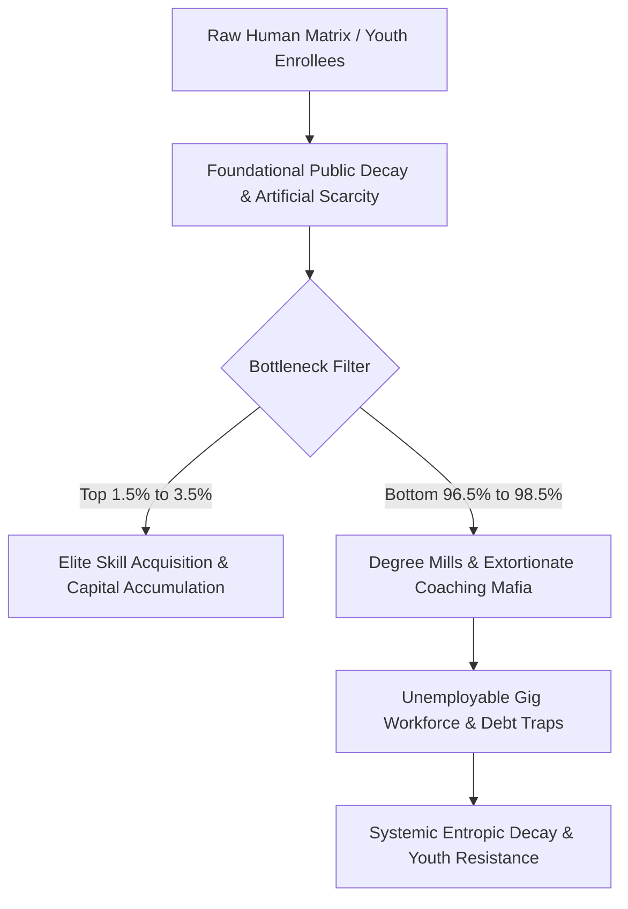

# TECHNICAL BRIEFING: SYSTEMIC RUIN OF EDUCATION AND COMMODITY EXTRACTION

---

## 1. EMPIRICAL ASSESSMENT OF LOCAL EDUCATIONAL DECAY & ELIMINATION DYNAMICS

### 1.1 Foundational Primary and Secondary Atrophy
Data from the Annual Status of Education Report (ASER) and national educational telemetry indicates a structural collapse at the primary and secondary base:
* **Learning Deficits**: Over $$50\%$$ of Grade 5 students in rural public schools are unable to read a Grade 2 level textbook or perform basic 3-digit division.
* **Multigrade Classrooms and School Shrinkage**: $$66\%$$ of Grade I and II public primary classrooms operate under multigrade arrangements (a single instructor managing multiple grades concurrently). Over $$52\%$$ of public primary schools maintain an enrollment of $$<60$$ total students due to parental flight toward low-fee private institutions.
* **Instructional Vacancies**: Over $$1,000,000$$ ($$10\text{Lakh}$$) sanctioned public teaching posts remain vacant across primary and secondary tiers nationwide.

### 1.2 Higher Education Bottlenecks and Hyper-Inflation
* **Central University Gatekeeping (CUET UG)**: Cut-off percentiles for top-tier public colleges (e.g., DU North Campus: SRCC, Hindu, Hansraj, St. Stephen's) sit between $$98.5\%$$ and $$99.8\%$$ percentile ($$780\text{--}795+ / 800$$) for general candidates in high-demand disciplines.
* **Public Capacity Scarcity**: Premier public higher education institutions accommodate less than $$1.5\%$$ of the $$40,000,000+$$ applicants nationwide, manufacturing an artificial bottleneck.

### 1.3 The Extreme Elimination Matrix
The public education infrastructure functions primarily as an elimination engine rather than a developmental system:

| Examination Matrix | Applicant Pool | Sanctioned / Tier-1 Seats | Effective Rejection Rate |
| :--- | :--- | :--- | :--- |
| **UPSC Civil Services (CSE)** | $$\sim 1,300,000$$ | $$\sim 1,000$$ | **$$99.92\%$$** |
| **IIT-JEE Advanced** | $$\sim 1,450,000$$ | $$\sim 17,500$$ | **$$98.80\%$$** |
| **NEET-UG (Medical)** | $$\sim 2,400,000$$ | $$\sim 55,000$$ (Govt MBBS) | **$$97.71\%$$** |
| **CAT (IIM Management)** | $$\sim 330,000$$ | $$\sim 5,500$$ | **$$98.34\%$$** |

---

## 2. UNIVERSAL PHYSICS & THERMODYNAMIC FORMULATION OF COGNITIVE TRANSMISSION

### 2.1 The Thermodynamic Law of Cognitive Transmission
Education is the foundational anti-entropic information transmission mechanism of a civilization. Physical systems naturally decay toward maximum entropy ($$S \to \infty$$). To maintain technical, physical, and administrative infrastructure, low-entropy cognitive patterns must be transferred from mature nodes to developing nodes.

$$\frac{d S_{\text{Civilization}}}{dt} \propto \frac{1}{\eta_{\text{Edu}}}$$

Where $$\eta_{\text{Edu}}$$ represents the cognitive transmission efficiency of the educational framework. When education is commodified or bottlenecked, $$\eta_{\text{Edu}} \to 0$$, accelerating systemic entropic decay.

### 2.2 Conservation and Uniform Distribution of Cognitive Potential
Raw cognitive potential and intelligence are uniformly distributed across the human population matrix. Intelligence is not localized to elite income brackets or specific geographies. 

When a civilization constructs artificial energy barriers—such as hyper-inflated tuition fees, capitation extractions, and hyper-concentrated elimination tests—it clamps down on $$>95\%$$ of its population matrix, inducing severe structural resistance and cognitive paralysis across the collective body.

### 2.3 The Skill Floor Theory of Class Generation
Access to high-quality education and industry-grade skill acquisition is artificially restricted to a $$2\%\text{--}5\%$$ numerical threshold of the population matrix. This artificial numerical restriction directly generates the elite class.

By constraining the skill floor, the system systematically manufactures an underprivileged, low-wage majority ($$95\%\text{--}98\%$$), driving economic inequality ($$L_{\text{Gini}} \approx 0.92,\text{EI} \approx 0.08,\text{TI} \approx 0.0847$$).

---

## 3. THE TRIAD OF EDUCATIONAL EXTORTION & COMMODITY INVERSION

### 3.1 Extraction Axes
1. **Axis 1 (Test-Prep and Coaching Industry)**: Extracts $$₹1.0\text{Lakh Crore} \to  ₹3.5\text{Lakh Crore} (12\text{B}\text{--} 42\text{B USD})$$ annually from household savings. Aspirants are funneled into 12–14 hour rote memorization factories via "dummy school" arrangements.
2. **Axis 2 (Private Seat and Capitation Fee Structure)**: Total cost for private or deemed university MBBS seats ranges from $$₹50\text{Lakh} \to ₹1.5+\text{Crore}$$. Private engineering and management degrees cost between $$₹10\text{Lakh} and ₹25\text{Lakh}$$ for substandard instruction and outdated curricula.
3. **Axis 3 (Examination Integrity Breakdown)**: Over 70 major competitive and recruitment exam paper leaks recorded across 15+ states (NEET-UG, REET, UP Police Constable, Bihar BPSC, SSC CGL), impacting $$>15,000,000$$ to $$20,000,000$$ aspirants. Dark-channel paper leaks and arbitrary grace marks corrupt national testing agencies (e.g., NTA).

### 3.2 The Cattle Fodder Paradox (The Fake Equilibrium)
* **Surface Ratio Illusion**: $$1,490,000$$ approved undergraduate engineering seats vs. $$1,450,000$$ JEE registered applicants presents a surface ratio of $$\sim 1:1$$.
* **Quality Rejection Reality**: Only $$\sim 52,500$$ seats ($$\sim 3.5\%$$) across IITs, NITs, and Tier-1 institutions provide industry-grade technical training.
* **Employability Metric**: Only $$3.84\%$$ of engineering graduates possess industry-grade software and algorithmic skills; $$>80\%$$ to $$85\%$$ remain unemployable in high-value technical sectors, forcing graduates into low-wage gig economies, delivery networks, or non-technical support roles.

---

## 4. SYSTEMIC TELEMETRY, HUMAN TOLL & STREET RESISTANCE DATA

### 4.1 Physiological and Mental Health Telemetry
* **Student Suicides (NCRB Data)**: National Crime Records Bureau statistics confirm over $$13,000$$ student suicides annually ($$>35$$ deaths per day; 1 every 40 minutes).
* **Examination Failure Mortalities**: $$12,598$$ youth deaths ($$<30$$ years old) documented over a 5-year window directly linked to examination results.
* **Batch Toxicity**: Public rank boards, color-coded uniforms, and "Star vs. Lower Batch" segregation contribute to clinical depression, panic disorders, and hypertension in $$40\%\text{--}50\%$$ of enrolled coaching aspirants.

### 4.2 Youth Resistance and Street Telemetry
Student-led mobilizations (e.g., Sansad Chalo march, Jantar Mantar rallies, CJP mobilization) reject the commodification of education despite heavy state suppression, including barricading, internet suspensions, and lathi-charges.

> "Education is Not a Commodity"

> "Empathy Over Empire"

> "Free, Fair and Quality Education is a Right of All"

---

## 5. MATHEMATICAL SYNTHESIS: SOVEREIGNTY TRIAD DEPENDENCY (TI COUPLING)

The Total Independence Index $$(\text{TI})$$ quantifies civilizational resilience through the coupling of Political Independence $$(\text{PI})$$, Economic Independence $$(\text{EI})$$, and Social Independence $$(\text{SI})$$:

$$\text{TI} = (\text{PI} +\text{EI} +\text{SI}) \times (\text{PI} \times\text{EI} \times\text{SI})$$

Given current educational commodification telemetry where:

* $$\text{PI} = 0.90$$ (High formal political sovereignty)
* $$\text{EI} = 0.08$$ (Severe economic vulnerability due to unviable skill generation and debt traps)
* $$\text{SI} = 0.70$$ (Social cohesion degraded by competitive elimination stress)

$$\text{TI} = (0.90 + 0.08 + 0.70) \times (0.90 \times 0.08 \times 0.70)$$

$$\text{TI} = (1.68) \times (0.0504) = 0.084672$$

### Conclusion
A Total Independence Index of $$\text{TI} \approx 0.0847$$ confirms that systemic educational breakdown acts as a primary vector of civilizational weakness. Converting learning into an extortionate lottery degrades human capital, inducing systemic entropic decay and technological dependency.
