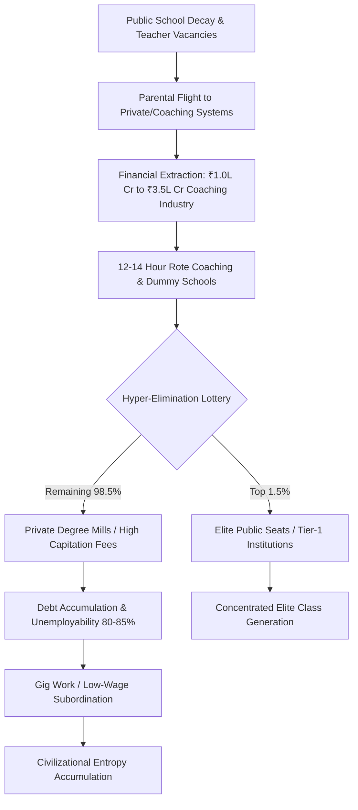

<script type="text/javascript" async
  src="https://cdnjs.cloudflare.com/ajax/libs/mathjax/2.7.7/MathJax.js?config=TeX-MML-AM_CHTML">
</script>

---

# SYSTEMIC RUIN OF EDUCATION AND COMMODITY EXTRACTION

---

## 1. EXECUTIVE SUMMARY & REAL-WORLD IMPACT

For the ordinary family, education was once understood as an honest ladder—a way for a child through hard work to learn, gain skills, and earn a dignified livelihood. Today, that ladder has been replaced by a predator matrix. What exists on the ground is a systemic machine that degrades public foundations, creates artificial scarcity, and extracts life savings from ordinary citizens to yield extreme rejection rates and structural unemployability.

Education is the fundamental thermodynamic mechanism by which low-entropy knowledge is transferred across generations to prevent civilizational breakdown. When this transfer mechanism is privatized and inverted into a financialized extraction filter, learning collapses into noise, signal turns into paper credentials, and millions of young individuals are forced into hyper-competitive elimination lotteries that yield widespread psychological trauma and social stagnation.

---

## 2. LOCAL EMPIRICAL MATRIX: FOUNDATIONAL DECAY AND HYPER-ELIMINATION

The breakdown of the education ecosystem operates at every tier, from rural primary schools to national competitive selection systems.

### A. Foundational Schooling Collapse
* **Learning Deficits (ASER Telemetry):** Over $50\%$ of Grade 5 students in rural public primary schools are unable to read a Grade 2 textbook or perform basic three-digit division.
* **Multigrade Classrooms:** $66\%$ of Grade 1 and Grade 2 classrooms operate under multigrade setups, where a single teacher simultaneously instructs multiple age groups.
* **Enrolment Shrinkage:** Over $52\%$ of public primary schools enroll fewer than $60$ total students, driven by parental flight to low-cost private facilities.
* **Teacher Vacancies:** Over $10\text{ Lakh}$ ($1\text{ Million}$) sanctioned public primary and secondary teaching posts remain vacant nationwide.

### B. Public Cut-Off Inflation & Seat Bottlenecks
Central University Entrance Test (CUET-UG) cut-offs for premier public colleges (such as Delhi University North Campus institutions) sit between $98.5\%$ and $99.8\%$ percentile ($780$ ext{--}$795+$ out of $800$) for general category applicants. Elite public higher education capacity represents less than $1.5\%$ of the over $40\text{ Million}$ applicants across the nation.

### C. The Extreme Elimination Matrix

| Competitive Examination | Total Applicants | Available Elite Seats | Rejection Rate (%) | Primary Outcome for Non-Selected |
| :--- | :--- | :--- | :--- | :--- |
| **UPSC Civil Services (CSE)** | $\sim 13.0\text{ Lakh}$ | $\sim 1,000$ | $99.92\%$ | Structural re-examination cycles / career stall |
| **IIT-JEE Advanced** | $\sim 14.5\text{ Lakh}$ | $\sim 17,500$ | $98.80\%$ | Redirection to private degree mills / debt |
| **NEET-UG (Medical)** | $\sim 24.0\text{ Lakh}$ | $\sim 55,000\text{ (Govt)}$ | $97.71\%$ | Massive capitation fees / forced migration |
| **CAT (IIM Management)** | $\sim 3.3\text{ Lakh}$ | $\sim 5,500$ | $98.34\%$ | High-interest student loans for Tier-3 MBAs |

### D. The Triad of Educational Extortion
1. **The Test-Prep and Coaching Industry:** Extracts between ₹1.0 Lakh Crore and ₹3.5 Lakh Crore ($12\text{ Billion}$ to $42\text{ Billion USD}$) annually from household savings, enforcing $12$ ext{--}$14$ hour daily rote memory routines using dummy school arrangements.
2. **Private Seat and Capitation Fee Structure:** Private or deemed university MBBS seats command fees ranging from ₹50 Lakh to ₹1.5 Crore. Substandard private engineering and management degrees cost between ₹10 Lakh and ₹25 Lakh while delivering outdated curricula.
3. **Exam Integrity Scams:** Over $70$ major paper leaks across $15$ states (including NEET-UG, REET, UP Police Constable, and BPSC) have affected more than $1.5\text{ Crore}$ to $2.0\text{ Crore}$ aspirants.

### E. Engineering Seat Reality vs. Quality

| Parameter | Metric / Telemetry |
| :--- | :--- |
| **Approved UG Engineering Seats** | $14.90\text{ Lakh}$ |
| **JEE Registered Applicants** | $14.50\text{ Lakh}$ |
| **Surface Application-to-Seat Ratio** | $\sim 1 : 1$ |
| **Industry-Viable Elite Seats (IIT/NIT/Tier-1)** | $\sim 52,500$ ext{ (}$3.5\%\text{)}$ |
| **Graduates with High-Level Algorithmic Skills** | $3.84\%$ |
| **Unemployable Graduates in Knowledge Economy** | $80\%$ ext{--}$85\%$ |

---

## 3. UNIVERSAL DYNAMICS: THERMODYNAMICS & MATHEMATICAL FORMULATION

### A. The Thermodynamic Law of Cognitive Transmission
Education is the primary low-entropy information transmission mechanism of a civilization. According to the Second Law of Thermodynamics, physical and social systems decay toward maximum disorder ($S \to \infty$) unless organized energy and information are applied.

The rate of civilizational entropy accumulation is inversely proportional to the efficiency of its educational transmission mechanism ($\eta_{$ ext{Edu}$}$):

$$\frac{dS_{$ ext{Civilization}$}}{dt} \propto \frac{1}{\eta_{$ ext{Edu}$}}$$

When $\eta_{$ ext{Edu}$}$ approaches zero due to artificial bottlenecks, paper leaks, and rote extraction, $S_{$ ext{Civilization}$}$ increases rapidly, leading to technological dependence and institutional decay.

```
                  CIVILIZATIONAL ENTROPY DYNAMICS
  
      High Transmission Efficiency (Low Entropy Growth)
      [ Mature Nodes ] --- ( Clean Knowledge Stream ) ---> [ Developing Nodes ]
                                                                    |
                                                                    v
                                                         ( Systemic Stability )

      Low Transmission Efficiency / Extraction Matrix (High Entropy Growth)
      [ Mature Nodes ] --- ( Financial Scarcity Filter ) -> [ Bottleneck ]
                                                                    |
                                                                    v
                                                         ( Entropy Accumulation )
```

### B. Class Generation and Energy Barrier Inversion
Human cognitive potential is distributed across the entire population matrix. Creating artificial financial and numerical energy barriers restricts high-tier skill acquisition to a $2\%$ ext{--}$5\%$ numerical threshold.

```
                         SKILL FLOOR & CLASS DIVISION
  
    +-------------------------------------------------------------------+
    |                         Total Population Matrix                   |
    +-------------------------------------------------------------------+
                                      |
                         [ Artificial Energy Barrier ]
                        (Fees, Rote Elimination Tests)
                                      |
            +-------------------------+-------------------------+
            | $2\% - 5\%$                                     | $95\% - 98\%$
            v                                                   v
     [ Monopolized Elite ]                             [ Underprivileged Base ]
    (Generated Elite Class)                           (Low-Wage Gig Labor Force)
```

This structural restriction manufactures an underprivileged $95\%$ ext{--}$98\%$ majority that is funneled into low-wage gig labor, driving wealth concentration ($L_{$ ext{Gini}$} \approx 0.92$).

### C. Sovereignty Triad Dependency Model
The overall Independence Index (\text{TI}$) of a population matrix is calculated using the interaction of Political Independence (\text{PI}$), Economic Independence (\text{EI}$), and Social Independence (\text{SI}$):

$$\text{TI} = ($ ext{PI}$ +$ ext{EI}$ +$ ext{SI}$) \times ($ ext{PI}$ \times$ ext{EI}$ \times$ ext{SI}$)$$

Using empirical live baseline inputs:
*$\text{PI} = 0.90
*$\text{EI} = 0.08
*$\text{SI} = 0.70

Evaluating the expression:

$\text{TI} = (0.90 + 0.08 + 0.70) \times (0.90 \times 0.08 \times 0.70)$$

$$\text{TI} = (1.68) \times (0.0504) = 0.084672$$

The calculation yields an overall Independence Index of$ ext{TI}$ \approx 0.0847$. The reduction in Economic Independence ($ ext{EI}$ = 0.08$) depresses the total sovereignty score, proving that credential debt and unemployability undermine national self-reliance.

---

## 4. SYSTEM FLOWCHART: THE EXTRACTION CYCLE



---

## 5. HUMAN TOLL AND RESISTANCE TELEMETRY

The systemic bottlenecking of educational access exacts a severe physiological and social toll across the nation:

* **Student Mortalities (NCRB Data):** The National Crime Records Bureau documents over $13,000$ student suicides annually (more than $35$ deaths per day). Over a five-year tracking window, $12,598$ youth deaths (under $30$ years of age) were directly recorded as caused by examination failure.
* **Psychological Distress:** Weekly public ranking boards, color-coded student uniforms, and "Star vs. Lower Batch" segregation in coaching hubs induce clinical depression and anxiety in $40\%$ ext{--}$50\%$ of enrolled aspirants.
* **Youth Resistance:** Massive mobilization across urban centers, such as the *Sansad Chalo* marches and Jantar Mantar demonstrations organized by youth groups like the CJP, oppose paper leaks and administrative failures.
* **Protest Slogans and Demands:** Core student demands center on slogans such as *"Education is Not a Commodity"*, *"Empathy Over Empire"*, and *"Free, Fair and Quality Education for All"*.

---

## 6. STRUCTURAL RESOLUTION & RESTRUCTURING MANIFESTO

To restore the educational transmission mechanism and dismantle the extortion matrix, the following structural steps are required:

```
                    RESTRUCTURING & REFORMS MODEL

  [ Primary Infrastructure ] ---> Fill 10 Lakh Teacher Vacancies & End Multigrade Classrooms
  [ Testing Framework ]       ---> Replace Rote Elimination with Capability Assessment
  [ Seat Expansion ]          ---> Expand Tier-1 Public University Capacity
  [ Regulatory Control ]      ---> Eliminate Capitation Fees & Ban Commercial Coaching Networks
```

1. **Reconstruction of Primary Public Infrastructure:** Fill all $10\text{ Lakh}$ vacant teaching positions in public schools immediately, ending multigrade classrooms and re-establishing baseline foundational literacy and numeracy.
2. **De-commercialization of Testing:** Ban private test-prep coaching affiliations with secondary schools ("dummy schools") and mandate full public transparency and auditing for national testing agencies.
3. **Expansion of High-Quality Public Capacity:** Increase elite public higher education seating capacity to match actual population distribution, eliminating artificial bottlenecks.
4. **Transition from Elimination to Capability:** Replace hyper-competitive, single-day rote elimination exams with multidimensional assessment models focused on core algorithmic, critical, and practical capabilities.

