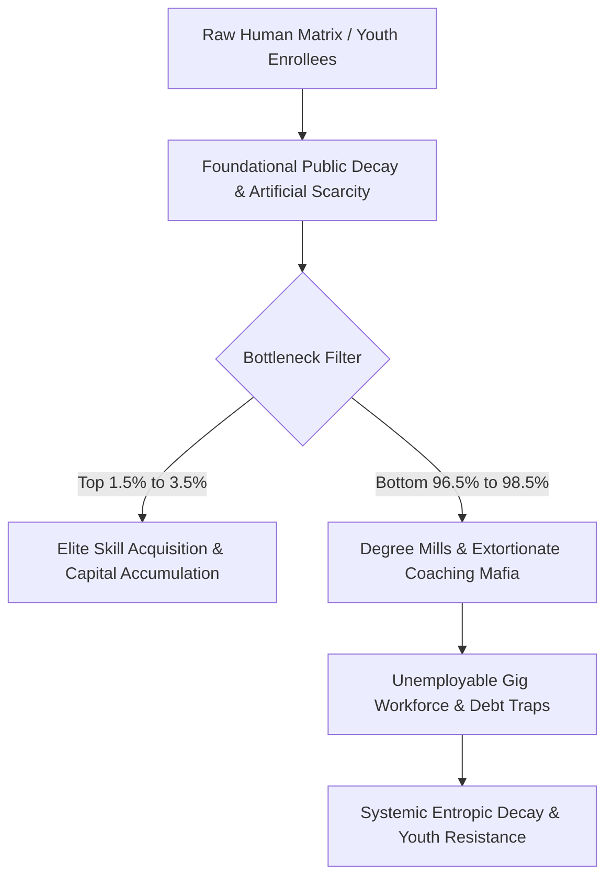

# TECHNICAL BRIEFING: SYSTEMIC RUIN OF EDUCATION AND COMMODITY EXTRACTION

---

## 1. EMPIRICAL ASSESSMENT OF LOCAL EDUCATIONAL DECAY & ELIMINATION DYNAMICS

### 1.1 Foundational Primary and Secondary Atrophy
Data from the Annual Status of Education Report (ASER) and national educational telemetry indicates a structural collapse at the primary and secondary base:
* **Learning Deficits**: Over 50 % and $50\%$ of Grade 5 students in rural public schools are unable to read a Grade 2 level textbook or perform basic 3-digit division.
* **Multigrade Classrooms and School Shrinkage**: 66 % of Grade I and II public primary classrooms operate under multigrade arrangements (a single instructor managing multiple grades concurrently). Over 52 % of public primary schools maintain an enrollment of $$<60$$ total students due to parental flight toward low-fee private institutions.
* **Instructional Vacancies**: Over $$1,000,000$$ ($$10\text{Lakh}$$) sanctioned public teaching posts remain vacant across primary and secondary tiers nationwide.

### 1.2 Higher Education Bottlenecks and Hyper-Inflation
* **Central University Gatekeeping (CUET UG)**: Cut-off percentiles for top-tier public colleges (e.g., DU North Campus: SRCC, Hindu, Hansraj, St. Stephen's) sit between 98.5 % and 99.8 % percentile ($$780 \text{--}795+ / 800$$) for general candidates in high-demand disciplines.
* **Public Capacity Scarcity**: Premier public higher education institutions accommodate less than 1.5 % of the $$40,000,000+$$ applicants nationwide, manufacturing an artificial bottleneck.

### 1.3 The Extreme Elimination Matrix
The public education infrastructure functions primarily as an elimination engine rather than a developmental system:

| Examination Matrix | Applicant Pool | Sanctioned / Tier-1 Seats | Effective Rejection Rate |
| :--- | :--- | :--- | :--- |
| **UPSC Civil Services (CSE)** | $$\sim 1,300,000$$ | $$\sim 1,000$$ | **99.92 %** |
| **IIT-JEE Advanced** | $$\sim 1,450,000$$ | $$\sim 17,500$$ | **98.80 %** |
| **NEET-UG (Medical)** | $$\sim 2,400,000$$ | $$\sim 55,000$$ (Govt MBBS) | **97.71 %** |
| **CAT (IIM Management)** | $$\sim 330,000$$ | $$\sim 5,500$$ | **98.34 %** |

---

## 2. UNIVERSAL PHYSICS & THERMODYNAMIC FORMULATION OF COGNITIVE TRANSMISSION

### 2.1 The Thermodynamic Law of Cognitive Transmission
Education is the foundational anti-entropic information transmission mechanism of a civilization. Physical systems naturally decay toward maximum entropy ($$S \to \infty$$). To maintain technical, physical, and administrative infrastructure, low-entropy cognitive patterns must be transferred from mature nodes to developing nodes.

$$\frac{d S_{\text{Civilization}}}{dt} \propto \frac{1}{\eta_{\text{Edu}}}$$

Where $$\eta_{\text{Edu}}$$ represents the cognitive transmission efficiency of the educational framework. When education is commodified or bottlenecked, $$\eta_{\text{Edu}} \to 0$$, accelerating systemic entropic decay.

```mermaid
graph TD
    A[Raw Human Matrix / Youth Enrollees] --> B[Foundational Public Decay & Artificial Scarcity]
    B --> C{Bottleneck Filter}
    C -->|Top 1.5% to 3.5%| D[Elite Skill Acquisition & Capital Accumulation]
    C -->|Bottom 96.5% to 98.5%| E[Degree Mills & Extortionate Coaching Mafia]
    E --> F[Unemployable Gig Workforce & Debt Traps]
    F --> G[Systemic Entropic Decay & Youth Resistance]
```
